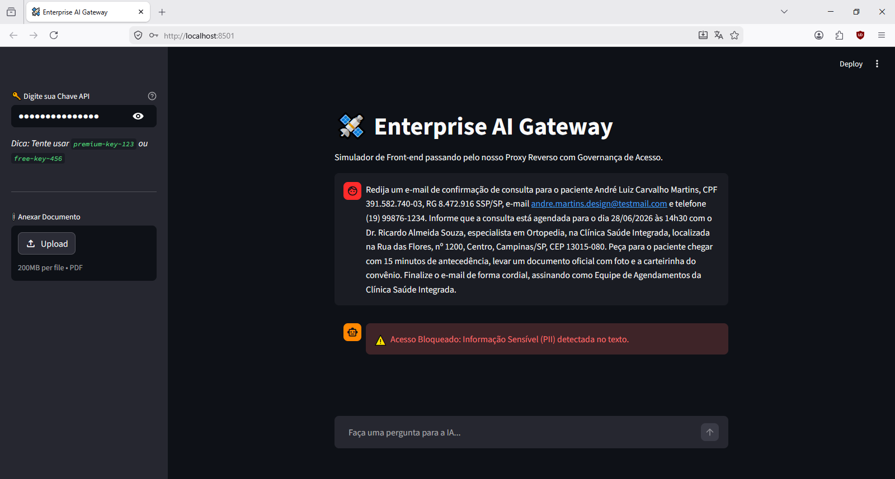
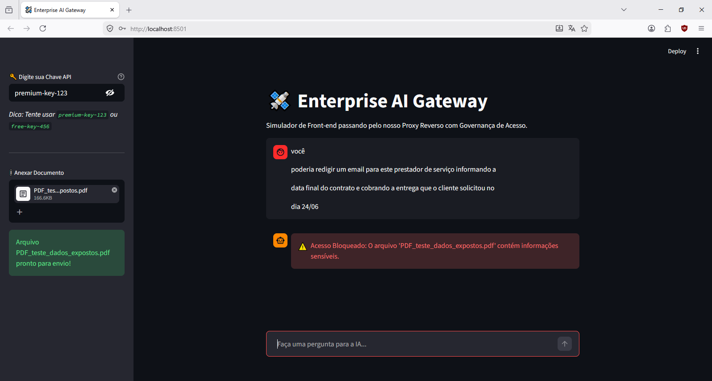
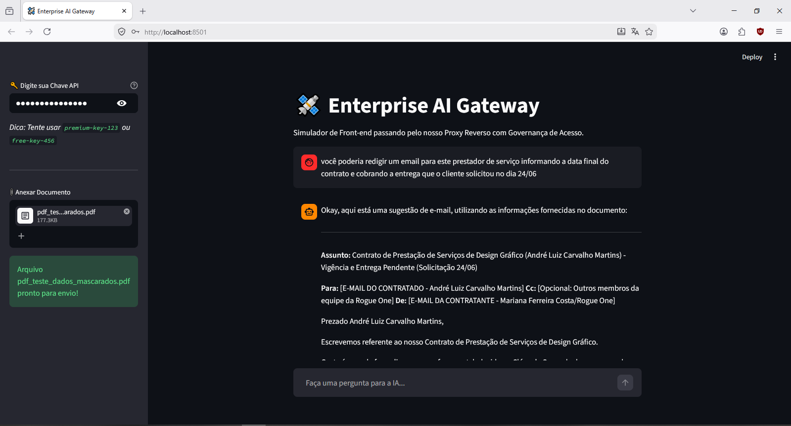
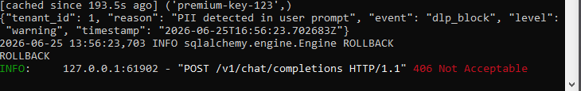
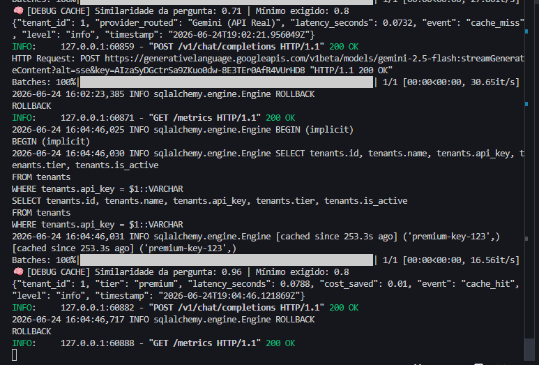
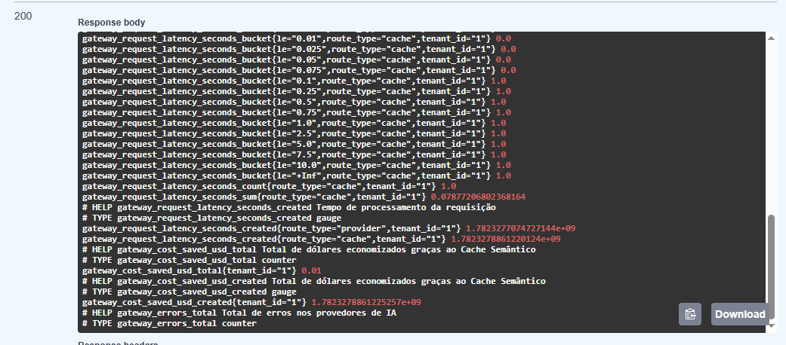
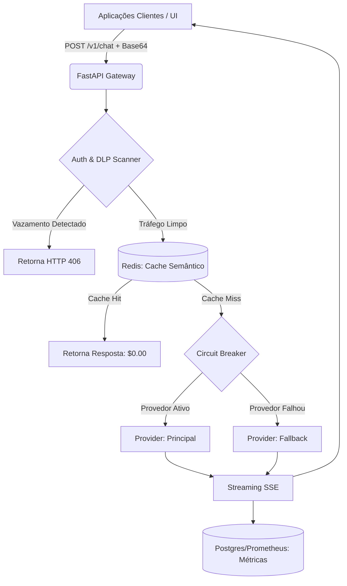

# 🛰️ Enterprise AI Gateway (LLM Router)

O **Enterprise AI Gateway** é um proxy reverso inteligente e assíncrono projetado para resolver os maiores gargalos de adoção de IA em grandes corporações: **Vazamento de Dados (PII), Vendor Lock-in e Custos Descontrolados**. 

Em vez de dezenas de aplicações consumirem APIs da OpenAI ou Anthropic diretamente, todo o tráfego passa por esta malha central, que aplica políticas de governança, resiliência e injeção de contexto em tempo real.

---

## 🚀 Principais Funcionalidades (Core Features)

* 🛡️ **DLP Scanner (Data Loss Prevention):** Interceptação ativa via Regex e extração em RAM (PyMuPDF). Impede que dados sensíveis (CPFs, Cartões, Contratos) vazem para provedores públicos, tanto no texto do prompt quanto dentro de anexos Base64.
* 🧠 **Context Injection:** Extrai textos de documentos seguros e injeta dinamicamente no prompt do usuário antes do envio, estabelecendo a fundação para arquiteturas RAG avançadas.
* 💰 **Semantic Cache:** Intercepta perguntas similares usando *Redis Vector Search*. Se ocorrer um *Cache Hit* (>80% de similaridade), a resposta é devolvida em milissegundos a custo $0.00.
* 🔄 **Circuit Breaker & Failover:** Padrão de resiliência corporativo. Se a API primária falhar, o circuito abre e roteia o tráfego de forma transparente para um modelo de Fallback.
* ⚡ **Streaming Assíncrono (SSE):** O Gateway atua como um "cano inteligente", utilizando `Server-Sent Events` para repassar tokens assim que são gerados (latência ultra-baixa).
* 📊 **Observabilidade Corporativa:** Logs estruturados em JSON e métricas de economia/latência expostas nativamente para Prometheus.

---

## 📸 Provas de Conceito (Showcase)

**1. Prevenção de Vazamento de Dados (DLP em Ação)**
O Gateway bloqueia instantaneamente requisições contendo PII, seja no texto livre ou dentro de PDFs anexados, retornando o status HTTP apropriado.

**2. Injeção de Contexto (Documentos Mascarados)**
Quando um documento "limpo" (sem PII) é enviado, o Gateway extrai o conteúdo e alimenta a LLM, permitindo respostas precisas baseadas no arquivo.

**3. Telemetria e Logs Estruturados (Visão do Backend)**
Monitoramento detalhado evidenciando o motor de Similaridade Vetorial (Cache Hit/Miss) e a interceptação de segurança no nível HTTP.

---

## 📐 Arquitetura de Software

Arquitetura assíncrona focada em alta concorrência e Inversão de Dependência:

🛠️ Como executar localmente
Clone o repositório e instale as dependências:

Bash
git clone [https://github.com/SEU_USUARIO/enterprise_AI_gateway.git](https://github.com/SEU_USUARIO/enterprise_AI_gateway.git)
cd enterprise_AI_gateway
python -m venv .venv
source .venv/bin/activate # ou .\.venv\Scripts\activate no Windows
pip install -r requirements.txt
Configuração de Ambiente:

Bash
cp .env.example .env
Suba a infraestrutura (Redis & Postgres) e inicie os serviços:

Bash
docker-compose up -d

# Terminal 1: Inicia o Backend FastAPI
uvicorn src.main:app --reload

# Terminal 2: Inicia o App Streamlit (Simulador UI)
streamlit run src/frontend/app.py